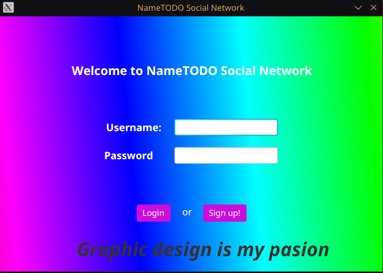

My project for APM at UBB.  
This was how I learned Java and JavaFX and how to integrate high-level langauges with database solutions, in particular here I used PostgreSQL.

Some images from how it looks, while making it I decided to make it look as goofy as possible so the "graphic design is my passion" meme was the base of all UI/UX decisions, all assets besides the rainbow background are hand-made (most notable in the chat window):

On loading the application presents the login page which also allows signing up:

 

Once logged in the user can see their friend list, search for profiles of other users or view their own and logout:

 

If the user has any pending incoming friend requests the friend requests button appears as a notification and upon pressing it the user is presented with a list of friend requests which they can either accept or deny:

 

Each profile has an assciated image which is stored in the database and can be uploaded from the profile update page:

 

The profile page of friends allows the user to open the conversation window, for users which are not friends of the user it instead allows to send a friend request:

 

The conversation page, allows message replies and updates in real time:

 
